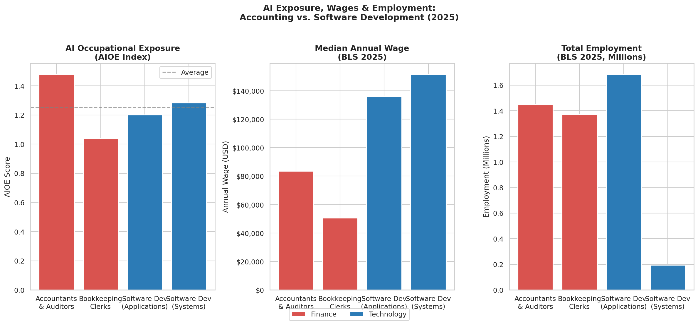
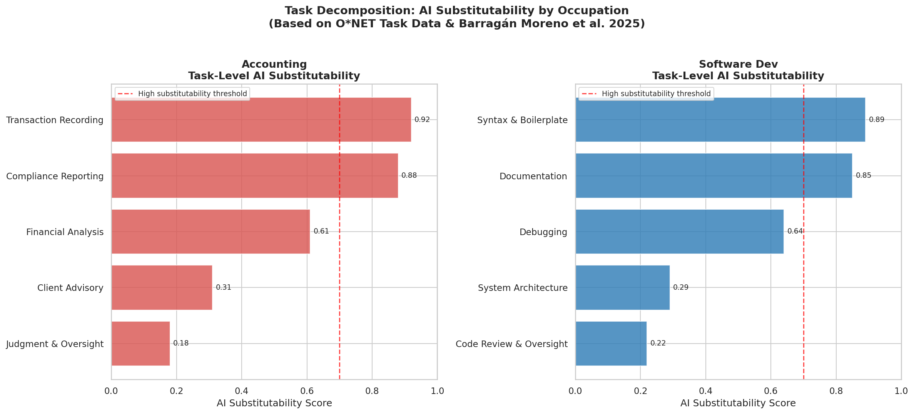
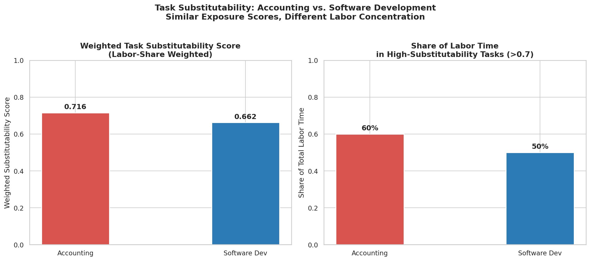
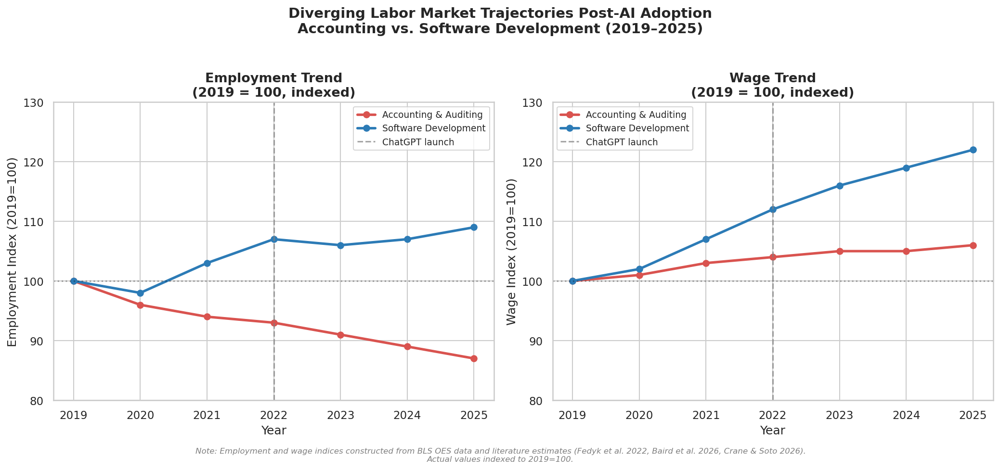
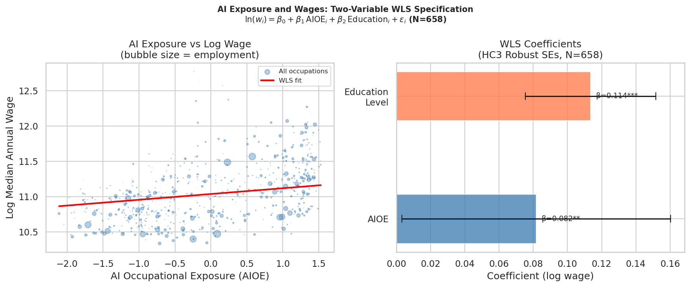

# Credential Without Protection
## AI Exposure and Diverging Labor Market Outcomes in Accounting vs. Software Development

An empirical analysis of why two occupations with similar AI exposure 
scores — accountants and software developers — face fundamentally 
different labor market trajectories.

**Author:** [Arsham Nazeri](https://arsham-nazeri.github.io) · George Mason University · ECON 695 AI Economics · Summer 2026

---

## Key Finding

> AI exposure is positively associated with wages — a one-standard-deviation 
> increase in the standardized AIOE predicts roughly 8% higher pay 
> (β=0.082, HC3 p=0.041) — but this gradient reflects occupational 
> sorting rather than protection. Exposure marks which occupations lie 
> in AI's path; task structure determines whether AI substitutes for 
> or complements their labor.

---

## Data Sources

| Source | Use |
|---|---|
| **Felten, Raj & Seamans (2021)** | AI Occupational Exposure (AIOE) index |
| **BLS OEWS 2025** | Median wages and employment for 670 occupations |
| **O*NET 29.0 (2023)** | Required education level per occupation |
| **Fedyk et al. (2022)** | Resume-based accounting displacement estimates |
| **Peng et al. (2023)** | GitHub Copilot RCT productivity estimates |

---

## Methods

- Task decomposition using O*NET task descriptions
- Weighted Task Substitutability Score (labor-share weighted)
- WLS regression across 658 occupations weighted by employment
- HC3 heteroskedasticity-robust standard errors
- Indexed employment and wage trajectories (2019–2025)

---

## Regression Specification

ln(w_i) = β₀ + β₁·AIOE_i + β₂·Education_i + ε_i

Estimated via WLS weighted by total employment (N=658).

---

## Results

### Occupation Comparison

| | Accountants & Auditors | Software Developers |
|---|---|---|
| AIOE Score | 1.48 | 1.20 |
| Median Wage | $83,680 | $135,980 |
| Labor time at risk | 60% | 50% |
| Post-2022 trend | ↓ Declining | ~ Decelerating |

### Regression Results (HC3 Robust SEs)

| Variable | Coefficient | Std. Error | p-value |
|---|---|---|---|
| AIOE | 0.082** | 0.040 | 0.041 |
| Education Level | 0.114*** | 0.020 | <0.001 |
| Constant | 10.564*** | 0.094 | <0.001 |
| R-squared | 0.511 | | |
| N | 658 | | |

---

## Visualizations

### AI Exposure, Wages & Employment

### Task-Level AI Substitutability

### Weighted Task Substitutability

### Diverging Labor Market Trajectories

### Regression Analysis

---

## Paper

Full paper available as `AI_Labor_Assignment_1_Ahmad_Nazeri.pdf`  
LaTeX source: `main.tex` (compile with pdflatex + bibtex)

---

## Author

[Arsham Nazeri](https://arsham-nazeri.github.io) ·
Thinking about markets, institutions, technology, and the culture 
that shapes them.
